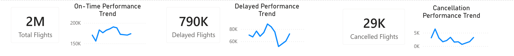
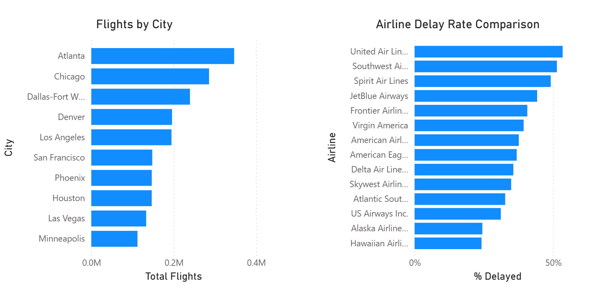
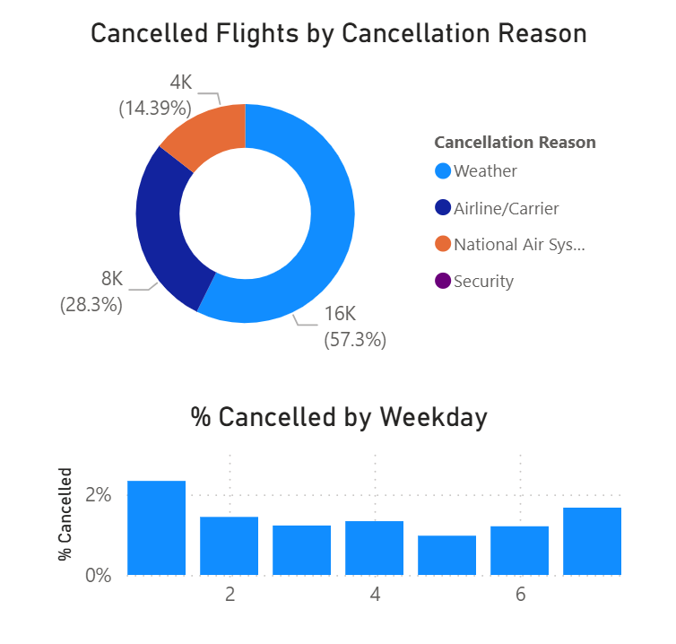
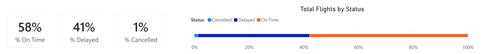

# U.S. Flight Performance Dashboard (2015)

## Overview

This project analyzes U.S. flight data from 2015 using Power BI, focusing on overall airline performance across three key outcomes: On-Time, Delayed, and Cancelled.

The dashboard provides a comprehensive view of operational efficiency, delay patterns, and cancellation causes across major cities and airlines.

---

## Objectives

* Evaluate overall flight performance (on-time vs delayed vs cancelled)
* Identify trends in delays and cancellations over time
* Compare airline performance based on delay rates
* Analyze the root causes of flight cancellations
* Explore how flight volume varies across major U.S. cities

---

## Tools & Technologies

* Power BI
* DAX (calculated measures and KPIs)
* Data modeling and transformation
* Excel Datasets from FAA for 2015 flights

---

## 📈 Key Metrics

* Total Flights: ~2 million
* On-Time Rate: 58%
* Delay Rate: 41%
* Cancellation Rate: 1%
* Delayed Flights: ~790K
* Cancelled Flights: ~29K

---

## Key Insights

## Overall Performance

* Only **58% of flights arrive on time**, while **41% experienced delays**
* Although cancellations are relatively low (1%), delays represent a significant operational challenge

---

## Delay Trends

* Delays fluctuate throughout the year, with noticeable spikes in certain months
* This suggests **seasonal demand or external factors** impacting performance

---

## Airline Performance

* There is a clear variation in delay rates across airlines
* Some airlines consistently underperform, indicating **operational inefficiencies or network constraints**

---

## Flight Volume by City

* **Atlanta, Chicago, and Dallas-Fort Worth** are the busiest hubs
* High traffic volume in these cities may contribute to increased delays due to congestion

---

## Cancellation Analysis

* **Weather is the leading cause of cancellations (~57%)**, making it the most significant external factor
* **Carrier-related issues (~28%)** are the second-largest contributor, indicating internal airline challenges
* NAS (air traffic system) and security issues account for a smaller portion

👉 This shows that while delays may be operational, **most cancellations are driven by uncontrollable external factors**

---

## Weekly Cancellation Patterns

* Cancellation rates vary slightly by weekday
* Certain days show higher cancellation percentages, suggesting **demand or scheduling effects**

---

## Dashboard Preview

### Executive Overview

### Operational Analysis

### Cancellation Insights

### Performance Summary

### Full Dashboard

---

## Project Files

* `flight_dashboard.pbix` → Full interactive dashboard
* `flight_dashboard.png` → Static version
* `images/` → Dashboard screenshots

---

## How to Use

1. Download the `.pbix` file
2. Open in Power BI Desktop
3. Interact with visuals to explore trends by airline, city, and time

---

## Author

Gage Gallardo

---
